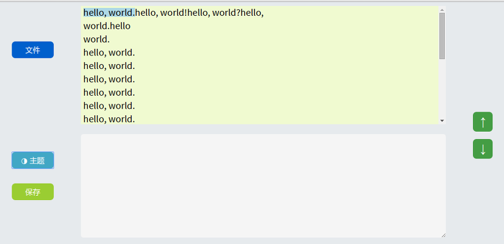
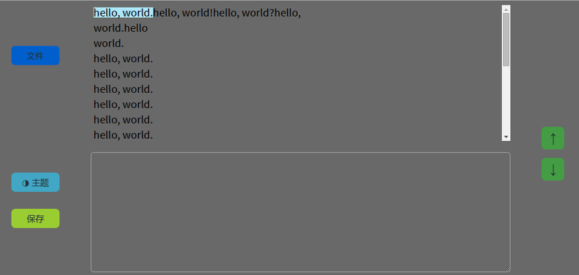

# 介绍

这是一个辅助翻译的工具。  
当我们在翻译文章的时候，因为你要不时查看译文，确保你打的字是正确的，所以我们的视线通常不能集中在源文的同一行。这个工具可以帮助你高亮当前正在翻译的那一行。

下面是一个截图：

  

# 用法

屏幕上有4个按钮和两个文本区域。左侧两个按钮是浏览文件按钮和更换主题按钮。右侧两个按钮是用来调整高亮文本位置的按钮。
 
## 浏览文件

你应该先点击浏览按钮浏览到要翻译的文本文件，当上方区域显示出原文后，你就可以在下方的文本框里写译文了。当你翻译完一句话后，你可以通过以下方式移动到下一句：
- 点击右侧向下箭头按钮
- 用鼠标点击下一句话
- 使用快捷键 alt + 上下键

## 夜间模式

当你要在夜间工作时，你可以点击主题按钮来更换到一个暗色的皮肤。
  
